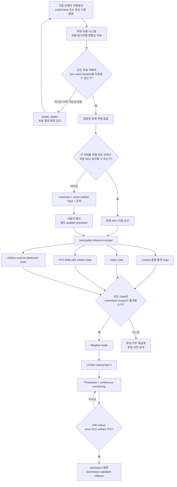

# Risk-Controlled Bakery Inference v2 설계

**상태:** 2026-08-03 사용자 승인
**대상 브랜치:** `codex/gpu-p95-100ms`
**문서 책임:** 모델과 내부 추론 알고리즘의 선택을 자유롭게 유지하면서, 검출 완전성·선택적 자동 승인·`Unknown + Top3` 사용자 확인·RTX 5080 p95 100ms·운영 중 fail-safe를 하나의 production 수락 계약으로 고정한다.

## 1. 문서 권한과 기존 설계의 관계

이 문서는 신규 risk-controlled GPU production 후보의 authoritative v2 설계다.

- `2026-08-03-rtx5080-gpu-p95-100ms-design.md`는 RF-DETR-L, RepViT-M1, DINOv3 조합을 보존한 Phase 1 역사적 설계로 유지한다.
- `2026-08-03-gpu-batch-evidence-phase1.md`는 이미 수행 중인 Phase 1 구현과 증거 계획으로 유지한다.
- 기존 `configs/pipelines/canonical_cpu.yaml`, `portable_cpu_smoke/`, legacy GPU 동작은 reference와 rollback 경로로 보존한다.
- v2 후보는 기존 canonical 구성을 조용히 변경하지 않고 별도의 versioned pipeline, manifest, calibration, receipt로 추가한다.
- 이 문서와 v1 문서가 신규 production 후보에 대해 충돌하면 이 문서가 우선한다. 기존 경로의 호환성 책임에는 v1과 저장소 계약이 계속 적용된다.

## 2. 최종 목표

Detector, classifier, embedding 모델, ensemble, fusion, 입력 해상도, 학습 방식, threshold, calibration, precision, camera 구성과 GPU 실행 방식은 자유롭게 변경할 수 있다.

완료된 시스템은 다음을 모두 만족한다.

1. 사용 가능하다고 승인한 scan의 모든 목표 객체 box, count, location이 ground truth와 일치한다.
2. 검출 완전성을 인증할 수 없는 scan은 부분 결과를 확정하지 않고 재촬영을 요구한다.
3. SKU를 사전 정의된 위험 한도 안에서 승인할 수 있는 객체만 자동 등록한다.
4. 안전하게 자동 승인할 수 없는 객체는 임의 SKU가 아니라 `Unknown`으로 유지한다.
5. `Unknown`에는 exact ranked Top3와 전체 활성 catalog 검색을 제공한다.
6. 사용자 선택은 immutable inference를 수정하지 않고 별도의 audited resolution로 저장한다.
7. RTX 5080에서 E/M/H와 전체 core worker warmed p95가 각각 `100ms` 이하이다.
8. Locked 품질, 통계적 위험, utility, 성능, artifact admission과 운영 Gate가 모두 통과한 후보만 production opt-in으로 승격한다.
9. 운영 중 검증 범위를 벗어나거나 위험·성능·artifact Gate가 깨지면 admission을 해제하고 last-known-validated 경로로 rollback한다.

`100%`와 `0%`는 모든 미래 입력에 대한 수학적 보장이 아니다. Locked acceptance에서 critical error 0건을 관측하고 실제 위험의 단측 95% 신뢰상한이 사전 정의된 한도 이하임을 보인다는 뜻이다. 실운영의 검증 범위 밖 입력은 재촬영 또는 `Unknown`으로 fail-closed 처리한다.

## 3. 핵심 용어와 위험 단위

### 3.1 Scan 상태

- `accepted_scan`: 모든 목표 객체의 box, count, location 완전성을 인증해 SKU 판정으로 진행한 scan
- `needs_retake`: 완전성을 인증할 수 없어 최종 객체 집합과 주문 반영을 금지한 scan
- `normal`: 모든 accepted object가 자동 승인된 상태
- `unknown`: 하나 이상의 accepted object가 자동 승인되지 않아 사용자 확인이 필요한 상태

### 3.2 객체 상태

- `auto_approved`: calibrated risk gate가 등록 SKU 자동 승인을 허용한 객체
- `Unknown`: 자동 승인을 거부했으며 exact Top3와 검색 경로를 갖는 객체
- `customer_top3`: 사용자가 immutable Top3 후보 중 하나를 선택한 audited resolution
- `customer_catalog`: 사용자가 활성 catalog 검색으로 선택한 audited resolution

### 3.3 Primary critical failure

Primary safety endpoint는 scan 단위 composite event다.

```text
accepted_scan_critical_failure =
    any box miss
    or duplicate
    or non-target detection
    or split
    or merge
    or count mismatch
    or location mismatch
    or wrong auto-approved SKU
```

한 거래에서 객체 하나가 누락되거나 잘못 자동 승인돼도 scan 전체가 critical failure다. 세부 오류는 원인 분석용으로 별도 보고하지만 production 안전 주장은 composite endpoint를 기준으로 한다.

## 4. 전체 시스템 다이어그램



## 5. Capture와 canonical frame set

### 5.1 Capture profile

각 후보는 versioned `CaptureProfile`을 갖는다.

- camera ID와 intrinsic/extrinsic identity
- 단일 frame, short burst, multi-frame 또는 보조 시점 구성
- 고정 트레이, 배경, 조명, 허용 반사 조건
- frame resolution, encoding, orientation과 timestamp 규칙
- frame 선택과 동기화 규칙
- blur, truncation, exposure, occlusion 등 calibrated capture-quality artifact
- profile JSON byte size와 SHA-256

Capture profile이 다르면 같은 모델이라도 별도 candidate와 별도 locked evidence로 취급한다.

### 5.2 Canonical frame set

- 각 frame은 EXIF transpose와 RGB 변환을 거친 visual frame을 canonical 좌표계로 사용한다.
- 보조 시점 또는 multi-frame을 사용할 때 frame별 좌표와 reference frame mapping을 명시한다.
- 모든 box는 유한하고 in-bounds인 `[x_min, y_min, x_max, y_max]`로 정규화한다.
- orientation, frame ordering, transform provenance와 input SHA-256을 receipt에 보존한다.
- codec 또는 mapping parity를 증명하지 못한 입력은 fallback으로 조용히 보내지 않고 `needs_retake` 또는 명시적 unverified 경로로 종료한다.

카메라 노출과 frame 획득 시간은 core inference 100ms 경계 밖이지만 별도의 scan-to-visible UX SLO에 포함한다.

## 6. Scene completeness와 재촬영

Detector confidence만으로 누락 부재를 인증하지 않는다. 출력되지 않은 객체에는 detector confidence가 없기 때문이다.

`SceneCompletenessGate`는 다음 evidence를 자유롭게 조합할 수 있다.

- 서로 다른 frame 또는 시점의 detector object-count 일치
- detector와 foreground/instance segmentation count 일치
- detector ensemble disagreement
- 별도 false-negative-risk 또는 scene-completeness model
- box overlap, occlusion, truncation, 최소 object size
- blur, exposure, reflection과 tray boundary
- temporal stability와 box correspondence
- 필요할 경우 depth, weight 또는 보조 sensor evidence

완전성 Gate는 `accepted_scan` 또는 `needs_retake`만 반환한다. Box 일부만 신뢰된다는 이유로 불완전한 객체 집합을 주문에 전달할 수 없다.

각 retake에는 machine-readable reason을 기록한다.

- `no_target_detected`
- `object_count_unstable`
- `view_disagreement`
- `overlap_or_occlusion`
- `truncated_object`
- `capture_quality_unverified`
- `completeness_risk_exceeded`

Reason을 추가하거나 threshold를 변경하려면 calibrated artifact와 새 locked evidence가 필요하다. 검증되지 않은 heuristic은 production Gate에 사용할 수 없다.

## 7. 자유로운 후보 추론 시스템

다음 구성은 후보마다 변경할 수 있다.

- one-stage, two-stage, DETR, segmentation 또는 ensemble detector
- global classifier, crop classifier, metric learner, vision transformer 또는 CNN
- embedding/support/prototype bank
- class-wise 또는 global selective gate
- local evidence, multi-view evidence와 temporal evidence
- score fusion, learned fusion 또는 rule-based consensus
- distillation, pruning, QAT/PTQ와 mixed precision
- PyTorch, ONNX Runtime, TensorRT, custom CUDA 또는 조합

단, 모든 후보는 다음 contract를 지킨다.

1. Stable object identity와 canonical box를 유지한다.
2. Detector, classifier, calibration, policy, support data와 runtime provenance를 보존한다.
3. 자동 승인과 abstention을 명시적으로 구분한다.
4. Candidate 수나 처리 한도를 이유로 객체를 버리거나 병합하지 않는다.
5. Backend, precision 또는 batching 변경이 final behavior를 바꾸면 별도 calibrated candidate로 취급한다.
6. Artifact 또는 runtime 검증 실패를 silent fallback으로 숨기지 않는다.

## 8. Selective SKU 자동 승인

자동 승인 gate는 단순 maximum softmax threshold 하나에 의존하지 않는다. 후보는 class-wise risk, calibrated logits, prototype distance, ensemble disagreement, OOD evidence, conformal risk control 등을 사용할 수 있다.

Production 후보는 다음을 만족한다.

- 승인된 객체에 대한 selective risk를 locked set에서 측정한다.
- SKU별 coverage와 오류를 별도 보고한다.
- 최신 validated baseline보다 자동 승인 coverage를 낮춰 안전 지표를 편법으로 만족시킬 수 없다.
- 검증 범위 밖 SKU, capture profile, camera, catalog revision 또는 distribution shift는 자동 승인하지 않는다.
- 승인 threshold, calibration과 tie-break는 immutable artifact로 고정한다.
- Runtime evidence가 calibration 범위를 벗어나면 `Unknown`이다.

## 9. Unknown Top3, catalog 검색과 audit

`Unknown` 객체는 다음 계약을 만족한다.

- `sku_id == null`
- `sku_name == "Unknown"`
- `decision_path`는 versioned unknown path다.
- Top3 길이는 정확히 3이다.
- rank는 정확히 `1, 2, 3`이다.
- 후보 SKU는 서로 다르고 active catalog snapshot에 존재한다.
- score는 유한한 `[0, 1]`이며 동률은 canonical catalog order로 해소한다.
- Top3는 사용자 보조 evidence이며 자동 acceptance를 우회하지 않는다.
- 내부 calibrated prediction set이 Top3보다 넓거나 Top3 coverage를 보장하지 못하면 catalog 검색을 명시적으로 강조한다.

사용자 resolution은 immutable inference와 별도다.

| 사용자 결과 | Immutable inference | Audited resolution |
| --- | --- | --- |
| 자동 결과 유지 | registered SKU 유지 | `ai_auto_customer_accepted` |
| Top3 선택 | `Unknown` 유지 | `customer_top3` + exact rank |
| Catalog 검색 선택 | `Unknown` 유지 | `customer_catalog`, rank 없음 |
| 취소 또는 실패 | `Unknown` 유지 | resolution 없음 |

미해결 `Unknown`은 자동 SKU별 합계와 결제 주문에 포함하지 않는다. 사용자 선택은 모델 정확도나 자동 승인 성공으로 재분류하지 않는다.

## 10. 통계적 품질 수락

### 10.1 데이터 분리

- development: architecture, 학습법, capture 방식과 병목 탐색
- calibration: completeness, selective gate, utility floor와 risk budget 결정
- locked acceptance: 최종 품질 수락 전용
- shadow: 실운영 분포에서 baseline과 비결제 비교

Locked 결과가 모델, threshold, precision, capture profile 또는 floor 선택에 영향을 주면 해당 set은 더 이상 locked가 아니며 새 locked set에서 다시 검증한다.

### 10.2 Primary scan-level Gate

- Canonical reference frame에서 IoU `0.50` 기준 deterministic one-to-one matching을 사용한다.
- Matching tie-break와 prediction ordering은 protocol에 고정해 같은 입력과 artifact에서 같은 판정을 재현한다.
- Unmatched ground truth는 miss, unmatched prediction은 duplicate 또는 non-target으로 deterministic attribution하고 split과 merge를 별도 보고한다.
- Matched object는 ground-truth location ID와 일치해야 하며, scan의 registered object count와 final-versus-ground-truth count가 일치해야 한다.
- Wrong SKU는 `auto_approved` object에만 critical error로 판정한다. `Unknown`과 사용자 resolution은 자동 승인 정확도로 재분류하지 않는다.
- `accepted_scan_critical_failure` 관측 0건
- critical failure rate의 exact one-sided 95% upper confidence bound `<=0.1%`
- 오류 0건일 때 upper bound는 `1 - 0.05^(1/n)`으로 계산한다.
- 이 기준을 만족하려면 accepted scan이 최소 2,995개 필요하다.

### 10.3 Auto-approval object-level Gate

- 자동 승인 객체의 wrong SKU 관측 0건
- wrong-auto-approval rate의 exact one-sided 95% upper confidence bound `<=0.1%`
- 자동 승인 객체 최소 2,995개

### 10.4 Slice와 공동 주장

- E/M/H, SKU, object count, camera, capture profile, 조명과 난이도 slice를 모두 보고한다.
- 각 slice에서 critical error 관측 0건을 요구한다.
- 표본이 부족한 slice에는 `<=0.1%` 주장을 붙이지 않고 `unverified`로 표시한다.
- Production의 primary 95% 주장은 여러 endpoint를 따로 결합하지 않고 composite critical failure에 적용한다.
- 세부 endpoint를 별도 primary claim으로 사용할 경우 Bonferroni, Holm 또는 사전 승인된 multiple-testing control을 적용한다.

### 10.5 Top3와 사용자 보조

- Locked `Unknown`에서 Top3 miss 관측 0건을 목표로 한다.
- Top3 recall, rank별 hit, catalog 전환율, 검색 성공률, 취소와 사용자 오선택을 보고한다.
- Top3 표본의 신뢰구간을 함께 보고한다.
- Top3 miss가 있더라도 catalog 검색과 fail-closed 주문 차단이 동작했는지 별도 평가한다.

## 11. Utility Gate와 편법 방지

전부 재촬영하거나 전부 `Unknown`으로 보내 critical error 0건을 만드는 후보는 수락하지 않는다.

Locked set을 열기 전에 calibration receipt에 다음 숫자를 고정한다.

- 정상 scan 승인율 하한
- 불필요한 재촬영률 상한
- 자동 SKU 승인율 하한
- `Unknown`율 상한
- Top3 recall 하한
- Catalog 검색 전환율과 검색 성공률 기준
- SKU, E/M/H와 object-count slice별 최소 coverage

각 floor는 최신 validated baseline의 receipt ID와 숫자를 명시하고 그보다 악화할 수 없다. 최신 baseline이 해당 지표를 제공하지 않으면 calibration set에서 business acceptance threshold를 먼저 승인하고 커밋한다. Locked 결과를 본 뒤 floor를 바꾸면 새 locked set이 필요하다.

## 12. RTX 5080 p95 100ms 성능 설계

### 12.1 Core worker 경계

Core 100ms는 필요한 encoded frame set이 worker 메모리에 전달된 순간부터 validated result payload가 메모리에 완성될 때까지다.

포함 범위:

- decode, EXIF transpose, RGB canonicalization
- multi-frame/reference mapping
- detector와 box decode
- scene-completeness/FN-risk evidence
- crop, classifier와 추가 evidence
- selective gate, fusion, `Unknown`과 Top3
- count/location aggregation
- provenance와 payload validation

제외 범위:

- camera exposure와 frame acquisition
- 사용자 tray 배치와 재촬영 행동
- Flutter render와 사용자 선택
- catalog 검색 입력 시간
- model/engine build와 최초 load

File-path compatibility wrapper는 disk I/O를 별도 stage로 보고한다. Core SLO에서 제외된 acquisition과 UI도 scan-to-visible UX receipt에 기록하며 core latency와 섞지 않는다.

### 12.2 성능 수락

- E p95 `<=100ms`
- M p95 `<=100ms`
- H p95 `<=100ms`
- 전체 p95 `<=100ms`
- verified RTX 5080 GPU path sample 100%
- silent fallback 0건
- retake, normal과 `Unknown` 경로를 표본에서 제외하지 않음
- model load와 warm-up은 core 표본에서 제외하되 별도 보고

개발 병목 탐색은 그룹별 최소 100회로 시작할 수 있다. 최종 performance receipt는 E/M/H 각각 최소 1,000회의 유효 warmed 관측을 요구한다.

### 12.3 필수 보고값

- 전체와 E/M/H별 p50, p90, p95, p99, max와 p95 confidence interval
- decode/canonicalization
- detection
- scene-completeness/FN-risk
- crop와 primary classification
- conditional evidence
- selective gate와 fusion
- `Unknown`/Top3와 payload validation
- frame, view, object와 conditional object 수
- retake, auto-approval과 `Unknown` 경로별 latency
- CPU/GPU memory peak
- GPU clock, power, temperature와 thermal throttling
- driver, CUDA, TensorRT, cuDNN, PyTorch와 Windows/WDDM 상태
- engine load와 warm-up 시간
- baseline 대비 absolute latency와 speedup

Stage p95의 합을 total p95로 사용하지 않는다. 각 sample의 wall-clock total을 기록해 total distribution을 직접 집계한다.

## 13. Artifact, runtime admission과 재현성

모든 production 후보는 다음을 hash-bound한다.

- capture profile과 preprocessing
- model architecture, checkpoint와 training receipt
- detector/classifier/embedding/support/prototype artifact
- calibration, threshold, risk controller와 fusion policy
- ONNX/TensorRT engine과 build recipe
- input/output binding, dtype, shape와 semantic meaning
- GPU compute capability, driver, CUDA, TensorRT와 cuDNN compatibility
- catalog snapshot, data/split manifest, seed와 code commit

각 external artifact는 ID, byte size, SHA-256, storage class와 expected local path를 갖는다. 대용량 dataset, checkpoint, engine과 raw receipt는 외부 저장소에 두고 Git에는 manifest, lock, compact summary와 reviewed conclusion만 둔다.

Admission 실패는 다음처럼 처리한다.

- benchmark: 즉시 `unverified`, fallback 금지
- production: 명시적으로 승인된 last-known-validated mode만 선택 가능
- 모든 fallback은 reason과 실제 runtime mode를 receipt에 기록
- artifact identity가 부족하면 자동 승인 금지

## 14. Shadow, monitoring과 rollback

### 14.1 단계

```text
offline candidate
  -> locked acceptance
  -> shadow mode
  -> limited canary/opt-in
  -> production
  -> continuous monitoring
```

Shadow에서는 기존 last-known-validated 경로가 주문 결과를 소유한다. Candidate는 같은 입력에 비결제 예측만 생성하고 box, count, SKU, `Unknown`, Top3, path, latency와 provenance 차이를 기록한다.

Shadow 최소 표본과 기간은 시작 전에 커밋한다. Shadow 결과로 candidate를 조정하면 새 version과 필요한 calibration/locked evidence를 만든다.

### 14.2 지속 감시

- 무작위 거래 human audit
- 사용자 Top3/catalog correction
- confirmed miss, duplicate, non-target, split와 merge
- wrong auto-approved SKU
- retake, `Unknown`, auto-approval과 search rate
- SKU, 매장, camera, 조명, 시간대와 catalog revision drift
- p95/p99 latency와 thermal throttling
- runtime fallback, artifact mismatch와 worker restart

### 14.3 Admission 해제

다음 사건은 신규 admission을 중단하고 last-known-validated rollback을 시작한다.

- confirmed critical failure
- hash 또는 runtime compatibility 불일치
- silent fallback
- committed utility floor 위반
- 반복된 performance SLO 위반
- drift가 validated envelope를 벗어남
- audit 또는 monitoring evidence 누락

Rollback rehearsal와 receipt가 없으면 운영 준비가 완료되지 않은 것이다.

### 14.4 사용자 correction과 재학습

사용자 correction은 production 모델을 실시간 변경하지 않는다. Correction은 immutable audit로 저장하고 별도 review를 거쳐 development data candidate로만 사용한다. 새 training, calibration 또는 policy는 새 artifact ID를 받고 development, calibration, locked와 shadow 절차를 다시 통과한다.

## 15. 책임 지향 구성요소

### `CaptureProfile`

허용 camera, tray, 조명, frame/view 구성과 capture artifact identity를 정의한다.

### `CanonicalFrameSet`

Encoded frame을 canonical RGB frame set과 reproducible transform provenance로 변환한다.

### `SceneCompletenessGate`

Box, count, location completeness를 인증하거나 reason을 포함한 `needs_retake`를 반환한다.

### `CandidateInferenceEngine`

자유롭게 선택한 detector, classifier, ensemble과 fusion으로 ordered object evidence를 생성한다.

### `SelectiveSkuGate`

Calibrated risk budget 안의 객체만 자동 승인하고 나머지를 `Unknown`으로 만든다.

### `AssistanceAssembler`

Immutable Top3와 catalog search context를 생성한다.

### `DecisionReceiptAssembler`

Inference, presentation, 사용자 resolution과 artifact/runtime provenance를 분리 저장한다.

### `AcceptanceEvaluator`

Scan-level critical failure, object-level auto-approval risk, utility와 latency Gate를 평가한다.

### `RuntimeAdmission`

승인된 capture, artifact, engine과 runtime 조합만 실행한다.

### `ProductionMonitor`

Shadow, drift, audit, SLO, admission 해제와 rollback을 담당한다.

각 component는 내부 모델이 바뀌어도 consumer가 안정적인 contract를 사용할 수 있어야 한다.

## 16. Error handling과 fail-closed 규칙

- Frame 수, identity 또는 transform 불일치: `needs_retake` 또는 request failure
- Box count/evidence alignment 불일치: result 생성 중단
- Non-finite score, box 또는 timing: result/receipt 거부
- Completeness evidence 부족: `needs_retake`
- SKU risk evidence 부족: `Unknown`
- Top3 schema 또는 active catalog 불일치: 사용자 resolution 경로 차단
- Artifact/hash/runtime mismatch: admission 실패
- GPU OOM 또는 backend 오류: benchmark `unverified`; production은 승인된 rollback만 허용
- Partial object output, arbitrary SKU substitution과 silent object truncation: 금지
- 사용자 resolution persistence 실패: 결제 주문 반영 금지

## 17. 테스트 전략

### 17.1 Unit/contract

- EXIF orientation과 multi-frame canonical mapping
- finite/in-bounds box normalization
- stable object identity, ordering과 tie-break
- exact Top3와 catalog snapshot validation
- inference/resolution audit 분리
- exact binomial upper confidence bound와 minimum sample count
- composite critical failure와 utility 계산
- artifact/runtime admission

### 17.2 Hermetic parity

- serial/batch/backend/precision candidate raw evidence 비교
- count, box, SKU, `Unknown`, Top3, path와 non-timing provenance 비교
- candidate가 독립 calibrated backend인 경우 reference 차이를 명시적으로 receipt에 기록

### 17.3 Capture integration

- multi-frame order와 timestamp
- 보조 시점 mapping
- 완전한 scene
- 완전 누락, 부분 가림, overlap, truncation, blur, exposure와 reflection
- scene-completeness false accept와 unnecessary retake

### 17.4 GPU integration

- RTX 5080 engine build/load/warm-up
- shape profile와 dynamic object/frame count
- conditional evidence
- CUDA Graph와 buffer reuse
- missing/corrupt engine, hash mismatch와 unsupported runtime
- fallback 차단

### 17.5 Locked quality

- accepted scan 최소 2,995개
- auto-approved object 최소 2,995개
- E/M/H, SKU, object count, capture profile과 난이도 slice
- critical failure와 wrong auto approval 0건
- utility floor와 Top3/search report

### 17.6 Performance

- E/M/H 최종 각각 최소 1,000 warmed sample
- path와 object/frame count가 섞인 실제 distribution
- p50/p90/p95/p99/max와 confidence interval
- power/thermal/background process evidence

### 17.7 Shadow/canary

- baseline 대조
- random audit
- drift trigger
- admission 해제
- rollback rehearsal

### 17.8 Repository policy

- private image, dataset, checkpoint, engine과 raw receipt의 Git 유입 차단
- manifest/lock/compact summary schema 검증
- `portable_cpu_smoke/`와 legacy behavior 회귀 방지

Skipped 또는 unavailable suite는 passed가 아니라 `unverified`다.

## 18. 단계별 전달

1. **Contract와 protocol:** v2 schema, critical-risk, utility, latency와 receipt 계약을 고정한다.
2. **Capture/completeness:** versioned multi-frame/aux-view input과 scene-completeness Gate를 구현한다.
3. **Candidate search:** detector, classifier, ensemble, fusion과 capture 후보를 development set에서 비교한다.
4. **Calibration:** selective auto-approval, retake와 utility floor를 disjoint calibration set에서 고정한다.
5. **User resolution:** `Unknown + Top3 + catalog`와 immutable audit를 end-to-end 검증한다.
6. **RTX 5080 optimization:** TensorRT, precision, tensor crop, buffer와 CUDA Graph를 병목 근거에 따라 적용한다.
7. **Locked acceptance:** primary critical risk, auto-approval risk, utility, Top3와 performance receipt를 만든다.
8. **Shadow/canary:** baseline 비교, drift, audit, admission과 rollback을 검증한다.
9. **Production opt-in:** 모든 receipt가 통과한 version만 활성화한다.

각 단계에서 품질 또는 provenance Gate가 깨지면 다음 최적화를 쌓지 않는다. 원인을 해결하거나 후보를 폐기한다.

## 19. 완료 조건

작업은 다음이 모두 참일 때만 완료다.

1. Capture, completeness, inference, selective gate, `Unknown`, Top3, catalog와 audit 계약이 구현되고 검증됐다.
2. Accepted scan critical failure 0건과 단측 95% upper bound `<=0.1%`의 committed locked receipt가 있다.
3. Auto-approved object wrong SKU 0건과 단측 95% upper bound `<=0.1%`의 committed locked receipt가 있다.
4. Utility floor가 최신 validated baseline보다 악화하지 않았다.
5. E/M/H와 전체 RTX 5080 core worker p95가 각각 `100ms` 이하인 committed receipt가 있다.
6. 모든 capture/model/calibration/policy/engine/runtime artifact identity와 compatibility가 검증된다.
7. `Unknown`은 자동 SKU 합계에서 제외되고 Top3/catalog resolution이 inference와 분리된다.
8. Shadow/canary, continuous monitoring, admission 해제와 rollback rehearsal가 통과했다.
9. Config, docs, payload, compact summary와 실제 runtime behavior가 일치한다.
10. 필수 suite가 skipped/unavailable이면 완료가 아니라 `unverified`다.

## 20. 비목표

- 모든 미래 입력에 대해 문자 그대로 오류 확률 0을 보장한다고 주장
- Locked 결과를 본 뒤 같은 set에 맞춰 threshold 또는 floor 수정
- 사용자 correction을 검증 없이 즉시 online learning에 반영
- User interaction 시간을 core 100ms와 섞어 보고
- Artifact identity가 다른 engine을 같은 candidate로 취급
- 모든 scan을 재촬영하거나 모든 객체를 `Unknown`으로 보내 안전 지표를 편법으로 만족
- Private/proprietary image, checkpoint 또는 engine payload를 Git에 커밋
- 기존 canonical CPU, `portable_cpu_smoke/` 또는 legacy GPU 경로를 삭제하거나 조용히 변경

## 21. 이론과 상용 근거

### Selective prediction과 risk control

- [SelectiveNet: A Deep Neural Network with an Integrated Reject Option](https://proceedings.mlr.press/v97/geifman19a.html): 자동 승인 risk와 coverage를 함께 최적화하는 reject-option 근거
- [Selective Classification via One-Sided Prediction](https://proceedings.mlr.press/v130/gangrade21a.html): 매우 낮은 false-positive risk에서 class-wise 자동 승인 영역을 찾는 근거
- [How to Fix a Broken Confidence Estimator](https://proceedings.mlr.press/v244/cattelan24a.html): raw softmax confidence만으로 abstention을 결정하면 안 되는 근거
- [Conformal Risk Control](https://openreview.net/pdf?id=33XGfHLtZg): bounded monotone loss와 false-negative risk를 calibration으로 통제하는 근거
- [Active, anytime-valid risk controlling prediction sets](https://proceedings.neurips.cc/paper_files/paper/2024/hash/6eb05d8bc6bd7bb6868c64b5802125bd-Abstract-Conference.html): 운영 중 순차적 risk monitoring과 active audit 근거
- [Performance of Conformal Prediction in Capturing Aleatoric Uncertainty](https://openaccess.thecvf.com/content/WACV2026/html/Hagos_Performance_of_Conformal_Prediction_in_Capturing_Aleatoric_Uncertainty_WACV_2026_paper.html): prediction-set size를 인간 ambiguity로 해석하지 말아야 하는 한계

### Object detection completeness

- [Active Domain Adaptation with False Negative Prediction for Object Detection](https://openaccess.thecvf.com/content/CVPR2024/html/Nakamura_Active_Domain_Adaptation_with_False_Negative_Prediction_for_Object_Detection_CVPR_2024_paper.html): detector가 출력하지 않은 객체의 undetectability를 별도 모델링할 필요성
- [Multivariate Confidence Calibration for Object Detection](https://openaccess.thecvf.com/content_CVPRW_2020/html/w20/Kuppers_Multivariate_Confidence_Calibration_for_Object_Detection_CVPRW_2020_paper.html): 위치와 box scale을 포함한 detector confidence calibration 근거

### RTX inference 최적화

- [NVIDIA TensorRT Best Practices](https://docs.nvidia.com/deeplearning/tensorrt/latest/performance/best-practices.html): measure-optimize-verify, batching, fusion, CUDA Graph와 안정적 benchmark
- [NVIDIA TensorRT for RTX Best Practices](https://docs.nvidia.com/deeplearning/tensorrt-rtx/latest/performance/best-practices.html): Blackwell precision과 built-in CUDA Graph 근거
- [RF-DETR TensorRT export](https://rfdetr.roboflow.com/develop/learn/export/): ONNX/TensorRT engine export와 GPU/runtime binding 근거

### 상용 서비스

- [BRAIN BakeryScan](https://corp.bb-brain.co.jp/packages/bakeryscan/index.html): 여러 빵의 종류와 수량을 일괄 인식하고 confidence 표시, 다음 후보와 인간 correction을 제공하는 베이커리 POS 선례
- [Mashgin](https://www.mashgin.com/solution/overview): multi-camera 3D vision과 local multi-item checkout 선례
- [Tiliter retail product recognition](https://www.tiliter.com/retail): 신선식품·비포장 상품 인식, checkout error flagging과 대규모 매장 배포 선례
- [Amazon Augmented AI human review](https://docs.aws.amazon.com/sagemaker/latest/dg/a2i-use-augmented-ai-a2i-human-review-loops.html): low-confidence prediction을 human review로 escalation하는 운영 패턴. 2026-07-30부터 신규 고객 접근이 종료됐으므로 신규 의존성 후보가 아니라 설계 참고로만 사용한다.

Vendor 정확도와 속도 수치는 공개된 denominator, locked split, p95와 오류 정의가 없으면 본 프로젝트의 수락 증거로 사용하지 않는다. 상용 자료는 문제와 UX의 현실성을 보여주는 참고이며, production 주장은 이 저장소의 committed receipt만 근거로 한다.

### Risk management

- [NIST AI RMF Core](https://airc.nist.gov/airmf-resources/airmf/5-sec-core/): 검증 범위 밖 fail-safe, ongoing monitoring, periodic review와 residual-risk 관리 근거
